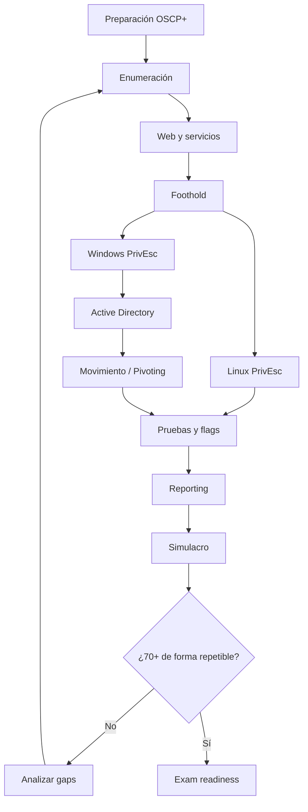

# OSCP Master Map

## 1. Qué valida realmente OSCP+

OSCP+ valida capacidad práctica para trabajar como penetration tester: identificar superficie de ataque, explotar vulnerabilidades, escalar privilegios, moverse por un entorno Windows/Active Directory y documentar todo con suficiente precisión para que otra persona pueda reproducirlo.

No debe estudiarse como una lista de exploits. La habilidad principal es construir una metodología resistente al estrés y a la incertidumbre.

## 2. Mapa mental

## 3. Prioridad profesional

### Tier S — dominar
- Enumeración TCP/UDP y de servicios.
- HTTP/HTTPS y ataques web comunes.
- Linux PrivEsc.
- Windows PrivEsc.
- Active Directory.
- Gestión de credenciales.
- Reporting y evidencias.
- Gestión del tiempo y rabbit holes.

### Tier A — muy importante
- SMB, LDAP, Kerberos, WinRM, RDP, SSH, FTP, SMTP, SNMP.
- Bases de datos y reutilización segura de credenciales en laboratorio.
- Tunneling y port forwarding.
- Modificación básica de PoCs.
- Transferencia de archivos y shells.
- Reconocimiento de configuraciones inseguras.

### Tier B — complementario
- Exploit development básico cuando lo exija un PoC.
- Cracking offline dentro de laboratorios.
- Automatización personal para notas y enumeración.

## 4. Relación con una base eJPT + formación AD

Una persona que llega con eJPT normalmente ya trae conceptos de redes, enumeración, explotación inicial y uso de herramientas. El salto a OSCP exige convertir esos conocimientos en una metodología menos guiada y mejorar especialmente:

1. PrivEsc Linux/Windows.
2. Active Directory y Kerberos.
3. Enumeración manual profunda.
4. Capacidad de corregir/adaptar exploits públicos.
5. Pivoting.
6. Reporting profesional.
7. Trabajo cronometrado y autónomo.

La preparación de AD de rutas como eCPPT/FCPPTv3 tiene un solapamiento útil con OSCP, pero OSCP debe entrenarse con su propio formato, restricciones y estilo de labs.

## 5. Definición de “dominado”

Un tema no está dominado porque puedas reconocerlo. Está dominado cuando puedes:

- explicar el concepto sin apuntes;
- identificar cuándo usarlo;
- ejecutarlo en un lab desde cero;
- solucionar al menos dos fallos habituales;
- obtener evidencias;
- documentarlo de forma reproducible;
- repetirlo una semana después.

## 6. Ciclo de una máquina

1. Recon inicial.
2. Full port scan.
3. Enumeración específica por servicio.
4. Inventario de hipótesis.
5. Priorización por evidencia, no por intuición.
6. Foothold.
7. Enumeración local.
8. PrivEsc.
9. Evidencia y notas.
10. Lecciones aprendidas.

## 7. Regla anti-rabbit-hole

Cada hipótesis debe tener:

- evidencia que la apoya;
- prueba concreta;
- límite de tiempo;
- resultado registrado.

Si una línea no produce nueva información tras varios intentos razonables, se aparca y se vuelve a enumerar.

## 8. Orden recomendado del repositorio

1. `01_METHODOLOGY`
2. `02_EXPLOITATION`
3. `03_PRIVESC`
4. `04_ACTIVE_DIRECTORY`
5. `05_PIVOTING`
6. `06_REPORTING`
7. `07_EXAM`
8. `08_PROGRESS`

## Fuentes

- OffSec OSCP+ Body of Knowledge: https://help.offsec.com/hc/en-us/articles/38543335188756-OSCP-Body-of-knowledge
- Authoritative References: https://help.offsec.com/hc/en-us/articles/37192004980628-Authoritative-References-List-OSCP
- Exam Guide: https://help.offsec.com/hc/en-us/articles/360040165632-OSCP-Exam-Guide
