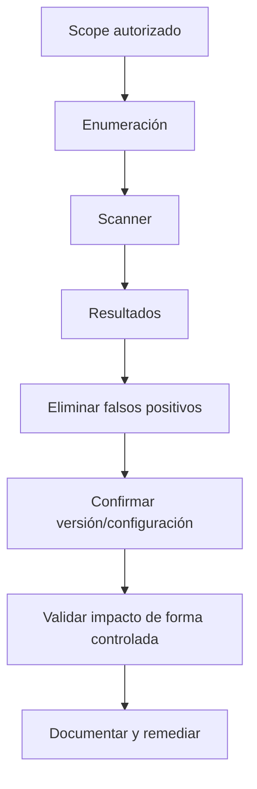

# Vulnerability Scanning — PEN-200 / OSCP+

## Objetivo

Aprender a usar scanners como herramientas de **triage y validación**, no como sustitutos de la enumeración manual.

El Body of Knowledge de OffSec incluye teoría de vulnerability scanning, Nessus y Nmap NSE.

## 1. Tipos de escaneo

### No autenticado
Simula visibilidad desde una posición externa o sin credenciales.

### Autenticado
Utiliza credenciales autorizadas para revisar configuración, software y parcheado con mayor profundidad.

### Network vs host/application
La herramienta y el alcance deben alinearse con el objetivo del assessment.

## 2. Flujo profesional



## 3. Nessus

Debes entender:

- qué es un plugin;
- severidad vs explotabilidad real;
- diferencia entre evidencia remota y local;
- authenticated scanning;
- falsos positivos;
- configuración del scan;
- alcance/IPs autorizadas.

### Preguntas después del scan

- ¿el servicio/version detectado coincide con Nmap?
- ¿la vulnerabilidad requiere configuración concreta?
- ¿el CVE aplica a esta build?
- ¿necesita autenticación?
- ¿la mitigación ya está presente?

## 4. Nmap NSE

Ejemplos seguros en laboratorio:

```bash
nmap -sV --script vuln -p <PORTS> <IP>
nmap --script-help <SCRIPT>
```

No ejecutes categorías agresivas indiscriminadamente fuera de un laboratorio. Lee siempre qué hace el script.

## 5. Vulnerability database mapping

Cuando aparece producto + versión:

1. confirmar fingerprint;
2. buscar advisory del fabricante;
3. revisar CVE/NVD;
4. buscar PoC de fuente primaria;
5. confirmar precondiciones;
6. documentar por qué aplica/no aplica.

## 6. CVSS no es probabilidad de éxito

Un CVSS alto puede no ser explotable en el entorno concreto. Un problema de configuración con CVSS menor puede ser el vector real.

Prioriza:

- exposición;
- precondiciones;
- autenticación;
- privilegios;
- versión real;
- configuración;
- cadena con otros hallazgos.

## 7. Checklist OSCP

- [ ] entiendo scan autenticado/no autenticado.
- [ ] puedo interpretar Nessus.
- [ ] conozco NSE.
- [ ] confirmo versiones manualmente.
- [ ] valido falsos positivos.
- [ ] sé mapear servicio → advisory/CVE/PoC.
- [ ] no confundo scanner con explotación.

Fuente oficial:
https://help.offsec.com/hc/en-us/articles/38543335188756-OSCP-Body-of-knowledge
