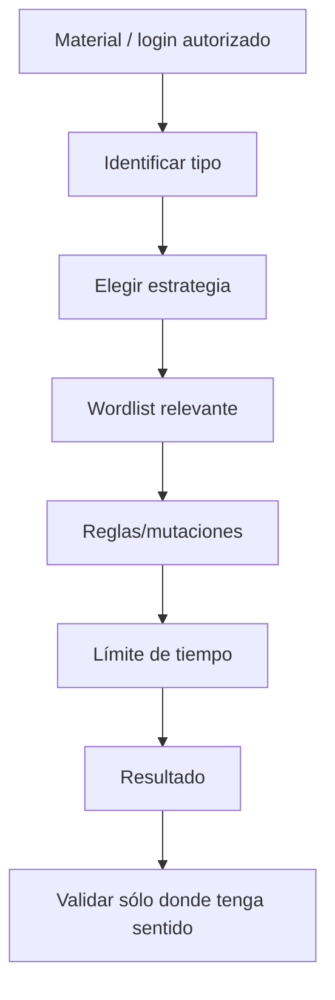

# Password Attacks — PEN-200 / OSCP+

> Exclusivamente para laboratorios, CTFs y sistemas donde exista autorización expresa. En entornos reales, el scope debe definir si están permitidos password spraying, brute force, lockout testing o relay.

## 1. Categorías

### Online
El objetivo responde en cada intento:
- SSH/RDP/login web;
- password spraying;
- validación de una credencial obtenida.

Riesgos: bloqueos de cuenta, ruido, consumo de recursos y alertas. Por eso en un pentest real se pactan límites.

### Offline
Trabajas sobre material que ya has obtenido legítimamente dentro del laboratorio:
- hashes;
- tickets;
- claves privadas cifradas;
- vaults/key files.

No generas intentos de login contra el servicio objetivo.

## 2. Metodología



## 3. Wordlists

No empieces siempre con la lista más grande. Prioriza:

- contexto del lab;
- nombres encontrados;
- patrones de la organización ficticia;
- defaults del producto;
- información de configuraciones/backups;
- reglas de mutación pequeñas y explicables.

## 4. Hashcat / John

Debes dominar:

- identificar el formato;
- seleccionar modo correcto;
- wordlist attack;
- reglas básicas;
- reconocer cuándo abandonar.

Ejemplo conceptual de laboratorio:

```bash
hashcat -m <MODE> hashes.txt <WORDLIST>
john --wordlist=<WORDLIST> hashes.txt
```

El modo exacto depende del hash/ticket/archivo. Verifícalo antes de ejecutar.

## 5. SSH private keys / password manager files

PEN-200 incluye cracking de passphrases de claves SSH y key files de gestores de contraseñas. El flujo es:

1. identificar formato;
2. convertir a un formato aceptado por la herramienta cuando proceda;
3. ataque offline;
4. validar únicamente en el entorno autorizado.

## 6. NTLM y Net-NTLMv2

Debes diferenciar:

- NTLM password hash;
- Net-NTLMv2 challenge/response;
- cracking offline;
- pass-the-hash;
- relay.

No son intercambiables. Entender qué material posees evita perder tiempo.

## 7. Kerberos

Relaciona este capítulo con AD:

- AS-REP material;
- service tickets de Kerberoasting;
- cracking offline;
- validación posterior de la cuenta.

## 8. Online attacks

En labs, herramientas de automatización permiten probar listas contra servicios. La habilidad OSCP es:

- identificar el servicio correcto;
- saber el formato de usuario;
- observar lockout/rate limits;
- evitar millones de intentos sin justificación;
- parar si una credencial encontrada cambia la estrategia.

## 9. Regla de tiempo

Nunca conviertas cracking en “esperar a que ocurra algo”. Define un presupuesto:

```text
Material:
Modo:
Wordlist:
Reglas:
Tiempo máximo:
Resultado:
Siguiente decisión:
```

## Checklist

- [ ] online vs offline.
- [ ] hash identification.
- [ ] Hashcat/John.
- [ ] wordlists/reglas.
- [ ] SSH key passphrases.
- [ ] NTLM vs Net-NTLMv2.
- [ ] Kerberos offline material.
- [ ] validación responsable.
- [ ] límites de tiempo.

Fuente oficial:
https://help.offsec.com/hc/en-us/articles/38543335188756-OSCP-Body-of-knowledge
