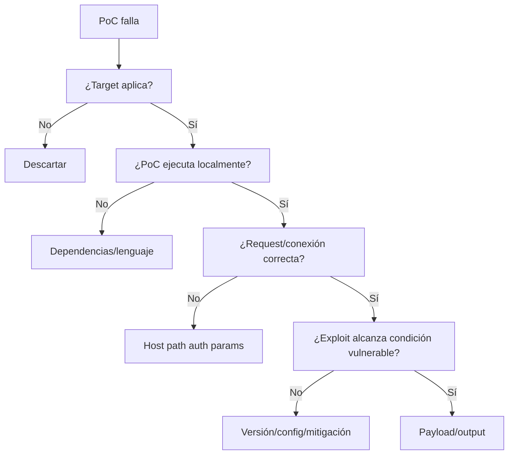

# Public Exploits, PoC Adaptation y Debugging

## Objetivo

PEN-200 no sólo espera que encuentres exploits públicos: debes entender cuándo aplican y ser capaz de corregir problemas frecuentes de ejecución.

## 1. Jerarquía de fuentes

1. Advisory del fabricante.
2. CVE/NVD como índice.
3. Investigador original.
4. Exploit-DB.
5. Repositorio GitHub mantenido.
6. Mirrors/blogs, con cautela.

## 2. Nunca ejecutar un PoC a ciegas

Antes:

- leer código;
- identificar conexiones salientes;
- comprobar comandos ejecutados;
- revisar ficheros que crea/modifica;
- dependencias;
- arquitectura;
- lenguaje/versión;
- variables hardcoded.

## 3. Preguntas de aplicabilidad

```text
Producto exacto:
Versión exacta:
OS/arquitectura:
Configuración requerida:
Autenticación requerida:
Puerto/path:
Mitigación presente:
PoC probado contra la misma rama?:
```

## 4. Problemas frecuentes en Python

- Python 2 vs 3.
- bytes vs strings.
- módulos no instalados.
- rutas hardcoded.
- URL/host incorrecto.
- SSL verification.
- encoding.

La corrección debe ser mínima. Cuantos más cambios hagas, más difícil saber qué rompiste.

## 5. Exploits web

Revisar:

- endpoint cambiado;
- parámetro renombrado;
- cookies/CSRF;
- autenticación;
- base path;
- HTTP vs HTTPS;
- redirect;
- JSON vs form data.

Burp Repeater ayuda a comprender la request correcta antes de adaptar un script.

## 6. Memory corruption — nivel PEN-200

OffSec incluye teoría de buffer overflow a alto nivel, cross-compilation y modificación de exploits. Para OSCP necesitas comprender:

- arquitectura;
- bad characters a nivel conceptual;
- offsets y direcciones cuando el ejercicio lo requiera;
- compilación para el objetivo;
- dependencias;
- por qué un exploit escrito para otro entorno puede fallar.

No conviertas esto en investigación avanzada de exploit development: PEN-200 busca capacidad de **adaptar** PoCs dentro del temario.

## 7. Compilación

Ejemplos de laboratorio:

```bash
gcc exploit.c -o exploit
x86_64-w64-mingw32-gcc exploit.c -o exploit.exe
```

Revisa errores del compilador y warnings. No borres flags arbitrariamente hasta que compile.

## 8. Debugging estructurado



## 9. Searchsploit workflow

```bash
searchsploit <PRODUCT> <VERSION>
searchsploit -x <ID>
searchsploit -m <ID>
```

Después del `-m`, trabajar sobre una copia y registrar cambios en notas.

## 10. Checklist

- [ ] confirmo producto/versión.
- [ ] leo el código.
- [ ] sé qué modificar.
- [ ] entiendo Python 2/3.
- [ ] puedo ajustar web requests.
- [ ] puedo cross-compile básico.
- [ ] pruebo cambios de uno en uno.
- [ ] documento el diff relevante.

Fuente oficial:
https://help.offsec.com/hc/en-us/articles/38543335188756-OSCP-Body-of-knowledge
