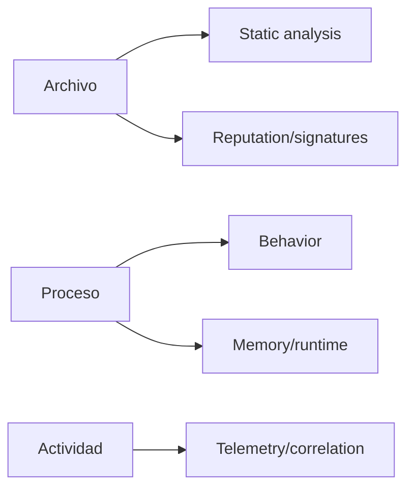

# Client-Side Attacks y Antivirus — conceptos PEN-200

> Este capítulo se mantiene deliberadamente en un nivel de laboratorio, diseño y reconocimiento. No incluye malware sigiloso, técnicas para evadir productos actuales contra terceros ni campañas de phishing reales.

# 1. Client-side attacks

## Concepto

A diferencia de explotar un servicio directamente expuesto, un client-side attack depende de que una aplicación del usuario procese contenido controlado por el atacante dentro de un escenario autorizado.

PEN-200 incluye:

- target reconnaissance;
- client fingerprinting;
- conceptos de Microsoft Office;
- Windows library files/shortcuts;
- integración de estas piezas en un escenario de laboratorio.

## 2. Qué debes aprender

- identificar versión/aplicación cliente;
- comprender trust boundaries;
- reconocer qué interacción requiere el escenario;
- documentar precondiciones;
- entender por qué una técnica funciona o deja de funcionar tras mitigaciones.

## 3. Office/macros — perspectiva de estudio

El objetivo en PEN-200 es comprender cómo contenido activo puede ejecutar acciones bajo el contexto del usuario cuando las políticas y configuraciones del laboratorio lo permiten.

Para preparación:

- aprende la arquitectura y controles de Office;
- entiende Protected View y políticas de macros;
- practica sólo con documentos creados para labs;
- no reutilices documentos ofensivos fuera de un entorno autorizado.

## 4. Windows Library / shortcut concepts

El temario incluye escenarios donde archivos de biblioteca/accesos directos pueden dirigir al usuario hacia recursos controlados dentro del laboratorio. Lo relevante es comprender:

- resolución de rutas;
- confianza del usuario;
- recursos remotos/locales;
- contexto de ejecución;
- mitigaciones.

---

# Antivirus Evasion — nivel conceptual

## 5. Qué incluye PEN-200

- amenazas conocidas vs desconocidas;
- componentes clave de AV;
- motores de detección;
- buenas prácticas de testing;
- evasión manual/automatizada dentro del laboratorio del curso.

## 6. Modelo mental

Un antivirus/EDR puede observar múltiples capas:

Cambiar únicamente un archivo no implica necesariamente cambiar comportamiento observable.

## 7. Qué estudiar de forma segura

- diferencia signature / heuristic / behavioral detection;
- AMSI y controles Windows a nivel conceptual;
- por qué los payloads conocidos son detectables;
- cómo documentar una prueba de control de seguridad;
- cómo comparar resultado antes/después de una mitigación en un lab.

## 8. Perspectiva profesional

En un engagement real, cualquier prueba de evasión debe estar explícitamente autorizada en Rules of Engagement. Un pentest estándar no concede automáticamente permiso para desplegar código que intente evadir controles corporativos.

## Checklist

- [ ] client-side vs server-side.
- [ ] fingerprinting.
- [ ] Office security model.
- [ ] library/shortcut concepts.
- [ ] static vs behavioral AV.
- [ ] testing ethics/scope.
- [ ] mitigaciones y reporting.

Fuente oficial:
https://help.offsec.com/hc/en-us/articles/38543335188756-OSCP-Body-of-knowledge
