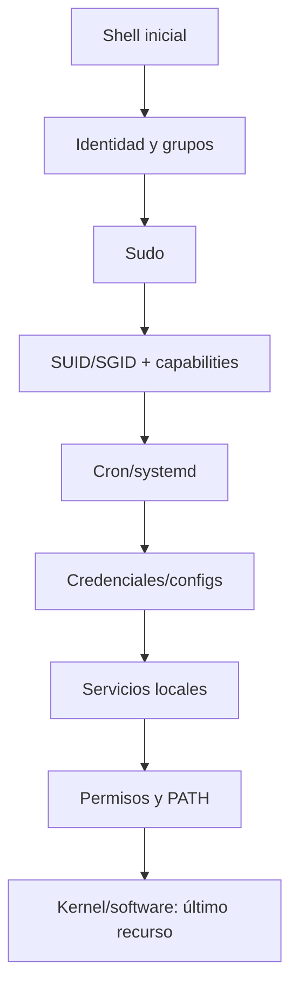

# Linux Privilege Escalation — OSCP

## Objetivo

Pasar de un usuario limitado a control administrativo mediante errores de configuración, credenciales, permisos o componentes vulnerables dentro de laboratorios autorizados.

## Flujo de trabajo



## 1. Contexto

```bash
id
whoami
groups
hostname
uname -a
cat /etc/os-release
env
```

Preguntas:

- ¿qué usuario soy?
- ¿qué grupos tengo?
- ¿qué distribución/kernel?
- ¿hay variables de entorno interesantes?

## 2. Sudo

```bash
sudo -l
```

Analizar:

- comandos concretos permitidos;
- `NOPASSWD`;
- comodines;
- variables preservadas;
- posibilidad de lectura/escritura;
- comportamiento del binario autorizado.

Referencia útil para comprender comportamiento legítimo de binarios en laboratorios: GTFOBins.

## 3. SUID / SGID

```bash
find / -perm -4000 -type f 2>/dev/null
find / -perm -2000 -type f 2>/dev/null
```

No asumir que un SUID extraño es automáticamente explotable. Identificar propietario, versión, función y permisos sobre ficheros relacionados.

## 4. Linux capabilities

```bash
getcap -r / 2>/dev/null
```

Prestar atención a capacidades que puedan otorgar acceso a ficheros, cambios de UID o capacidades de administración.

## 5. Cron y tareas

```bash
cat /etc/crontab
ls -la /etc/cron.*
systemctl list-timers --all
```

Buscar:

- scripts editables;
- rutas relativas;
- directorios editables usados por root;
- binarios/scripts ejecutados con privilegios.

## 6. Servicios y sockets locales

```bash
ss -lntup
ps auxww
systemctl --type=service --state=running
```

Un servicio ligado a `127.0.0.1` puede revelar una interfaz administrativa, base de datos o aplicación no accesible externamente.

## 7. Credenciales

Buscar con criterio, evitando ruido masivo:

```bash
grep -RniE 'password|passwd|secret|token|key' /var/www /opt /home 2>/dev/null
find /home -maxdepth 3 -type f \( -name '*.conf' -o -name '*.ini' -o -name '*.yml' -o -name '*.yaml' -o -name '*.env' \) 2>/dev/null
```

Lugares frecuentes:

- `.env`;
- configs web;
- backups;
- scripts operativos;
- historiales;
- claves SSH;
- repositorios Git locales.

## 8. Permisos débiles

Revisar:

- directorios escribibles;
- scripts ejecutados por usuarios privilegiados;
- archivos de configuración modificables;
- PATH y llamadas sin ruta absoluta;
- mounts/NFS.

## 9. Automatización

Herramientas como LinPEAS pueden servir como **segunda pasada**. No sustituyen la enumeración manual porque en examen debes entender por qué una vía es relevante.

Flujo recomendado:

1. 10–15 min manuales.
2. Automatización.
3. Revisar findings contra la enumeración manual.
4. Validar una hipótesis cada vez.

## 10. Kernel exploits

Trátalos como último recurso:

1. confirmar versión exacta;
2. confirmar aplicabilidad;
3. revisar PoC;
4. comprender requisitos;
5. evitar romper el host de laboratorio innecesariamente.

## Checklist de dominio

- [ ] `sudo -l` interpretado correctamente.
- [ ] SUID/SGID.
- [ ] capabilities.
- [ ] cron/timers.
- [ ] servicios locales.
- [ ] credenciales/configs.
- [ ] permisos/PATH.
- [ ] NFS/mounts.
- [ ] herramientas automáticas interpretadas, no copiadas ciegamente.
- [ ] reporte reproducible.
