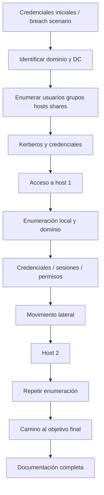

# Active Directory para OSCP+

## Por qué es crítico

El conjunto de Active Directory representa hasta 40/100 puntos del examen actual. Además, el Body of Knowledge de OffSec asigna un 26% al dominio Active Directory.

## 1. Fundamentos que deben estar automatizados mentalmente

- dominio, bosque, árbol;
- Domain Controller;
- LDAP;
- Kerberos;
- NTLM;
- DNS integrado en AD;
- usuarios y grupos;
- SPNs;
- GPO;
- ACLs;
- SYSVOL;
- shares;
- sesiones y administración remota.

## 2. Flujo conceptual



## 3. Reconocimiento básico

En un entorno autorizado, empezar identificando:

- dominio DNS;
- FQDN del DC;
- IP del DC;
- hosts accesibles;
- servicios 53/88/135/139/389/445/464/636/3268/5985/3389, etc.;
- credenciales iniciales y su alcance.

Ejemplos de consultas de laboratorio:

```bash
nmap -sC -sV -p 53,88,135,139,389,445,464,636,3268,5985,3389 <DC_IP>
```

## 4. SMB

Objetivos:

- identificar shares;
- permisos;
- archivos interesantes;
- scripts/configuración;
- usuarios o nombres de hosts.

Herramientas habituales en labs:

```bash
smbclient -L //<HOST>/ -U '<DOMAIN>/<USER>%<PASS>'
smbclient //<HOST>/<SHARE> -U '<DOMAIN>/<USER>%<PASS>'
```

## 5. LDAP / objetos de dominio

Aprender a responder:

- ¿quiénes son los usuarios?
- ¿qué grupos existen?
- ¿qué usuarios son privilegiados?
- ¿qué ordenadores existen?
- ¿qué SPNs hay?
- ¿qué cuentas tienen configuraciones interesantes?

Herramientas frecuentes: ldapsearch, ldapdomaindump, BloodHound/SharpHound, PowerView y herramientas de Impacket.

## 6. Kerberos

### AS-REP Roasting

Concepto: ciertas cuentas sin preautenticación Kerberos permiten obtener material cifrado que puede comprobarse offline en un entorno autorizado.

### Kerberoasting

Concepto: cuentas con SPN pueden permitir solicitar tickets de servicio; bajo determinadas condiciones, esos tickets pueden someterse a comprobación offline de contraseñas.

Lo importante para OSCP no es memorizar una sola sintaxis sino saber:

1. cuándo una técnica aplica;
2. qué información necesitas;
3. qué output esperas;
4. qué haces si no obtienes resultados;
5. cómo validas una credencial obtenida sin perder tiempo.

## 7. BloodHound

BloodHound sirve para visualizar relaciones y caminos de privilegios. No debe convertirse en una caja negra.

Preguntas al revisar un grafo:

- ¿qué usuario controlo?
- ¿de qué grupos forma parte?
- ¿qué sesiones existen?
- ¿qué ACLs o derechos tiene?
- ¿qué host puede administrar?
- ¿hay rutas cortas hacia usuarios/grupos privilegiados?

### Regla

Cada edge que uses debe poder explicarse en lenguaje humano: **quién controla qué, por qué, y qué permiso permite avanzar**.

## 8. Reutilización y validación de credenciales

En un laboratorio, una credencial obtenida debe tratarse como una nueva pieza de información:

- usuario;
- dominio/local;
- contraseña/hash/key;
- host de origen;
- servicios donde se ha validado;
- privilegios observados.

Evita probar indiscriminadamente contra enormes rangos. En OSCP el objetivo es metodología, no generar ruido.

## 9. Movimiento lateral

Debes entender conceptualmente varios canales administrativos:

- WinRM / PowerShell Remoting;
- SMB-based remote execution;
- RDP;
- WMI;
- servicios/tareas remotas.

El examen tiene restricciones de herramientas. Revisa siempre la guía oficial vigente antes del intento.

## 10. Pivoting dentro de AD

OffSec indica que puede haber pivoting: cualquier contenido del curso puede estar sujeto a examen. Entrena redes donde el segundo segmento sólo sea visible después de comprometer un host intermedio.

## 11. Estrategia AD

1. Confirmar credenciales iniciales.
2. Obtener nombres de dominio/DC/hosts.
3. Enumerar SMB/LDAP/Kerberos.
4. Construir mapa de relaciones.
5. Obtener el primer acceso justificable.
6. Enumerar localmente + dominio desde la nueva posición.
7. Registrar credenciales y sesiones.
8. Moverse únicamente cuando haya evidencia.
9. Capturar evidencias de cada objetivo.
10. Dejar el informe prácticamente escrito durante el proceso.

## 12. Errores frecuentes

- lanzar BloodHound y no interpretar edges;
- obsesionarse con roasting aunque no haya candidatos;
- no comprobar shares;
- no revisar archivos/configs de usuarios comprometidos;
- olvidar sesiones y grupos locales;
- usar una credencial sin registrar dónde funciona;
- confundir cuenta local con dominio;
- no entender DNS y nombres;
- ignorar pivoting.

## Checklist

- [ ] LDAP.
- [ ] SMB.
- [ ] Kerberos.
- [ ] usuarios/grupos/computers.
- [ ] BloodHound.
- [ ] PowerView.
- [ ] Impacket.
- [ ] WinRM.
- [ ] credenciales y hashes en laboratorio.
- [ ] movimiento lateral.
- [ ] pivoting.
- [ ] documentación AD reproducible.

## Fuentes oficiales

- Exam FAQ: https://help.offsec.com/hc/en-us/articles/4412170923924-OSCP-Exam-FAQ
- Exam changes: https://help.offsec.com/hc/en-us/articles/29865898402836-OSCP-Exam-Changes
- Body of Knowledge: https://help.offsec.com/hc/en-us/articles/38543335188756-OSCP-Body-of-knowledge
