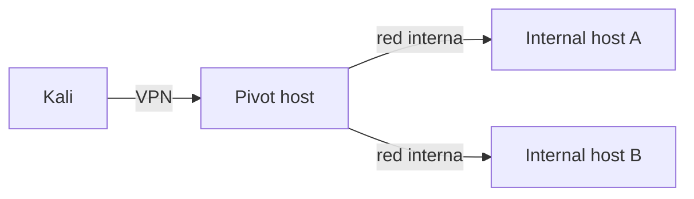

# Pivoting, Tunneling y Port Forwarding — OSCP

## Objetivo

Acceder de forma controlada a servicios o segmentos que no son directamente alcanzables desde Kali, utilizando únicamente infraestructura autorizada.

## Conceptos

- Local port forwarding.
- Remote port forwarding.
- Dynamic SOCKS proxy.
- Chisel/SSH tunneling.
- Proxychains.
- Rutas y múltiples interfaces.

## 1. Descubrir que necesitas pivotar

Tras un foothold:

```bash
ip addr
ip route
ss -lntup
```

En Windows:

```powershell
ipconfig /all
route print
netstat -ano
```

Busca:

- interfaces adicionales;
- subredes desconocidas;
- servicios ligados sólo a localhost;
- rutas que Kali no posee.

## 2. Local forwarding con SSH

Patrón conceptual:

```bash
ssh -L <LOCAL_PORT>:<INTERNAL_HOST>:<INTERNAL_PORT> user@pivot
```

Tu máquina escucha localmente y el pivot alcanza el destino interno.

## 3. Dynamic SOCKS

```bash
ssh -D 1080 user@pivot
```

Después, herramientas compatibles pueden usar un proxy SOCKS. En algunos casos se usa `proxychains`.

## 4. Chisel

Chisel es útil cuando SSH no está disponible. Debes comprender cliente/servidor, dirección del túnel y qué puerto escucha cada extremo, en lugar de memorizar una receta única.

## 5. Errores frecuentes

- confundir IP de Kali, pivot y objetivo;
- olvidar rutas;
- túnel creado en dirección equivocada;
- servicio sólo ligado a 127.0.0.1;
- usar `proxychains` con herramientas que no se comportan bien a través de SOCKS;
- perder tiempo sin dibujar la red.

## 6. Dibuja siempre la topología



Añade IPs, interfaces y puertos reales a tus notas.

## 7. Checklist

- [ ] identificar rutas e interfaces.
- [ ] local forwarding.
- [ ] remote forwarding.
- [ ] SOCKS.
- [ ] proxychains.
- [ ] chisel.
- [ ] SSH tunneling.
- [ ] documentar topología.
- [ ] probar conectividad antes de explotar.

OffSec indica en su FAQ que puede requerirse pivoting en el conjunto AD; cualquier contenido del curso puede ser materia de examen.

Fuente: https://help.offsec.com/hc/en-us/articles/4412170923924-OSCP-Exam-FAQ
