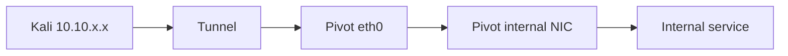

# Advanced Tunneling — PEN-200

> Para laboratorios y redes expresamente autorizadas.

## 1. Qué añade este capítulo

Además de SSH local/dynamic/remote forwarding, PEN-200 incluye conceptos de tunneling a través de restricciones de red y herramientas como Chisel. El objetivo OSCP es comprender la topología y elegir el túnel mínimo necesario.

## 2. Matriz de decisión

| Necesidad | Patrón conceptual |
|---|---|
| acceder desde Kali a 1 servicio interno | local forward |
| usar varias herramientas contra red interna | SOCKS/dynamic |
| exponer hacia Kali un servicio accesible desde pivot | remote forward |
| no hay SSH, pero existe conectividad HTTP permitida en lab | herramienta HTTP tunneling como Chisel |

## 3. SSH remote forwarding

Patrón:

```bash
ssh -R <REMOTE_PORT>:<TARGET_HOST>:<TARGET_PORT> user@<SSH_SERVER>
```

Dibuja siempre quién escucha y quién inicia la conexión.

## 4. Chisel — modelo mental

Chisel crea túneles sobre HTTP/WebSockets. En un lab debes dominar:

- qué lado actúa como server;
- qué lado actúa como client;
- puerto de control;
- qué puerto se publica;
- si el túnel es normal o reverse;
- cómo verificar que está activo.

En vez de memorizar una única línea, escribe antes:

```text
Kali IP:
Pivot IP externa:
Pivot IP interna:
Internal target:
Servicio final:
¿Quién puede conectar a quién?:
¿Dónde necesito escuchar?:
```

## 5. Socat

PEN-200 incluye port forwarding con herramientas *NIX como Socat. Conceptualmente puede unir dos sockets y reenviar tráfico. Úsalo para entender forwarders simples en labs y registra siempre qué interfaces/puertos quedan escuchando.

## 6. Windows forwarding

El temario incluye conceptos con:

- `ssh.exe`;
- Plink;
- Netsh.

No es necesario convertir el capítulo en una colección de variantes. Practica al menos una ruta nativa Windows y una ruta multiplataforma.

## 7. DNS tunneling

OffSec incluye DNS tunneling/dnscat en el Body of Knowledge. Para preparación OSCP:

- comprende que encapsula datos dentro de tráfico DNS;
- entiende cliente/servidor y resolución;
- reconoce por qué puede funcionar cuando otros canales están limitados;
- practica únicamente en el laboratorio del curso o uno propio.

No uses técnicas de tunneling para saltarte controles de redes ajenas.

## 8. Troubleshooting

Checklist:

1. ¿hay ruta desde el pivot al objetivo?
2. ¿el puerto final está abierto?
3. ¿el túnel está escuchando donde crees?
4. ¿firewall local bloquea?
5. ¿usas `127.0.0.1` o una interfaz externa?
6. ¿proxychains está configurado para el puerto correcto?
7. ¿la herramienta soporta SOCKS/TCP correctamente?
8. ¿DNS/resolución cambia al pivotar?

## 9. Diagrama de notas



Añade debajo:

```text
Tunnel technology:
Listener:
Forwarded port:
Target:
Validation command:
```

## Checklist

- [ ] SSH local.
- [ ] SSH dynamic.
- [ ] SSH remote.
- [ ] Chisel conceptual/práctico en lab.
- [ ] Socat.
- [ ] Windows native forwarding.
- [ ] DNS tunneling conceptual/lab.
- [ ] troubleshooting de rutas.

Fuente oficial:
https://help.offsec.com/hc/en-us/articles/38543335188756-OSCP-Body-of-knowledge
