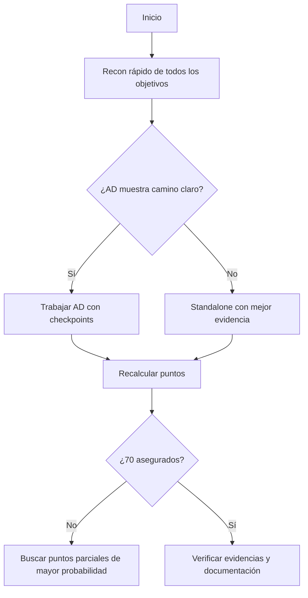

# OSCP+ — Formato, reglas y estrategia de examen

> Verificado contra documentación pública de OffSec disponible en septiembre de 2026. Revisa siempre la guía oficial inmediatamente antes de tu intento porque las reglas pueden cambiar.

## 1. Estructura actual

### Standalone

3 máquinas × 20 puntos = **60 puntos**.

Por máquina:
- acceso inicial: 10;
- escalada de privilegios: 10.

### Active Directory

1 set de 3 máquinas = **40 puntos**.

- máquina 1: 10;
- máquina 2: 10;
- máquina 3: 20.

### Aprobado

**70/100**.

No existen bonus points en el formato actual.

## 2. Escenarios de aprobado publicados por OffSec

La FAQ oficial ofrece ejemplos como:

- 40 AD + 3 `local.txt` = 70.
- 40 AD + 2 `local.txt` + 1 `proof.txt` = 70.
- 20 AD + 3 `local.txt` + 2 `proof.txt` = 70.
- 10 AD + 3 máquinas standalone completas = 70.

Esto demuestra que **los puntos parciales importan**.

## 3. Tiempo

La guía de examen establece una ventana práctica prolongada y una fase posterior de entrega de documentación. Comprueba los tiempos exactos y tu hora de inicio en la guía/candidate handbook vigente al programar el examen.

## 4. IA

OffSec indica en su FAQ actual que **KAI u otros chatbots no están permitidos durante el examen ni durante la fase de reporting**.

Esto significa que tu repositorio debe estar preparado antes del examen y ser útil sin depender de asistencia de IA.

## 5. Metasploit y herramientas restringidas

OffSec mantiene restricciones específicas. La FAQ indica, entre otras cosas, que Metasploit sólo puede utilizarse bajo las condiciones descritas por la política vigente y no puede convertirse en un mecanismo para saltarse las limitaciones mediante pivoting.

No memorices una interpretación antigua: abre la guía oficial la semana del examen y vuelve a revisar la sección de restricciones.

## 6. Estrategia de puntos

No existe una única ruta correcta. Piensa en **valor esperado por hora**.

Ejemplo conceptual:



## 7. Checkpoints recomendados

Cada cierto tiempo registra:

```text
Puntos confirmados:
Puntos posibles cercanos:
Máquina actual:
Hipótesis activas:
Tiempo invertido:
¿Rabbit hole?:
¿Tengo evidencias?:
```

La decisión de seguir o cambiar debe basarse en nueva evidencia, no en el tiempo ya invertido.

## 8. Anti-rabbit-hole

Señales de alarma:

- repites variaciones del mismo payload sin nueva evidencia;
- llevas mucho tiempo en una versión/CVE sin confirmar la versión;
- ignoras otros puertos;
- un exploit falla por razones que no comprendes y sigues ejecutándolo;
- asumes que el vector “debe ser” web/SMB/Kerberos porque te resulta familiar.

Acción:

1. registrar dónde estás;
2. hacer una pausa real;
3. volver al inventario;
4. revisar nombres, puertos, DNS, credenciales y datos que no has conectado;
5. priorizar una hipótesis distinta.

## 9. Evidencias

En cuanto consigas un objetivo puntuable:

- captura la evidencia;
- registra el usuario/host;
- guarda el comando exacto;
- confirma que puede reproducirse;
- actualiza tu tabla de puntos.

## 10. Simulacros

Entrena al menos tres tipos:

### Simulacro técnico corto
4–6 h. Dos máquinas. Objetivo: metodología.

### Simulacro AD
Cadena de varios hosts. Objetivo: enumeración, credenciales, movimiento y documentación.

### Simulacro completo
Entorno tipo examen, cronometrado, sin walkthrough, documentación simultánea y posterior informe.

## 11. Criterio personal para reservar examen

No uses “he hecho X máquinas” como única métrica. Reserva cuando puedas demostrar:

- 3 simulacros recientes con rendimiento estable;
- al menos 2 con equivalente ≥70 puntos;
- PrivEsc Linux/Windows sin depender de una checklist externa paso a paso;
- AD con una metodología repetible;
- informes reproducibles;
- capacidad de abandonar rabbit holes;
- sueño/descansos planificados.

## Fuentes oficiales

- https://help.offsec.com/hc/en-us/articles/360040165632-OSCP-Exam-Guide
- https://help.offsec.com/hc/en-us/articles/4412170923924-OSCP-Exam-FAQ
- https://help.offsec.com/hc/en-us/articles/29865898402836-OSCP-Exam-Changes
- https://help.offsec.com/hc/en-us/articles/40393367449108-OSCP-Candidate-Handbook
