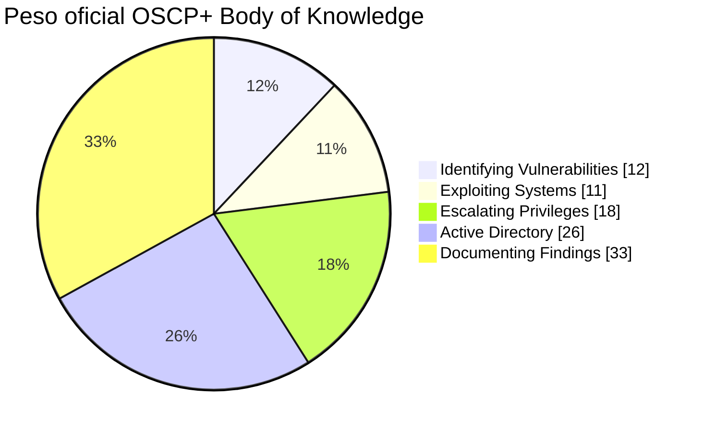
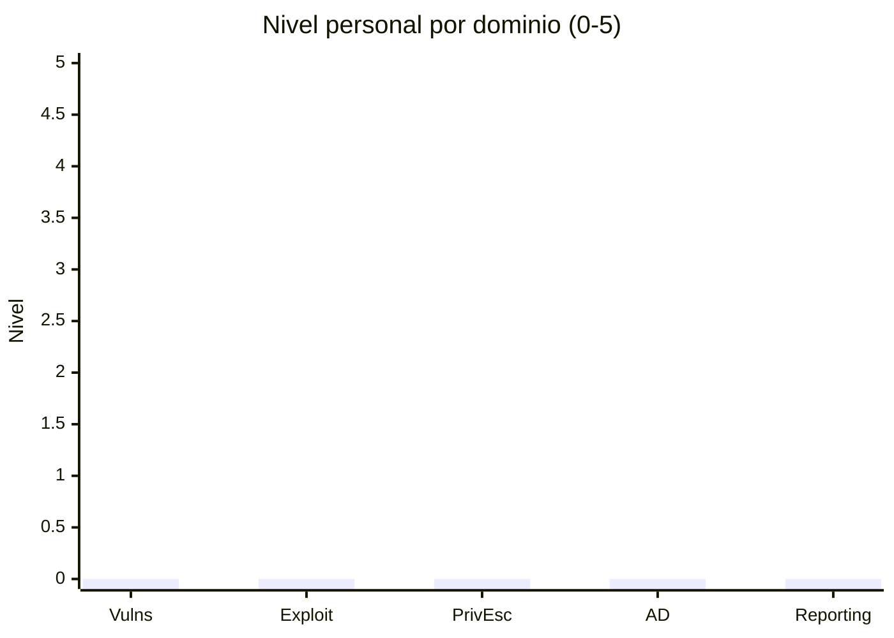

# OSCP Readiness Scorecard

## Importante

Este documento usa dos tipos de porcentajes:

1. **Peso oficial del Body of Knowledge** publicado por OffSec.
2. **Readiness personal estimado**, que es una métrica de estudio creada para este repositorio y **no** una probabilidad oficial de aprobar.

## 1. Pesos oficiales OffSec

| Dominio | Peso oficial |
|---|---:|
| Identifying Vulnerabilities | 12% |
| Exploiting Systems | 11% |
| Escalating Privileges | 18% |
| Active Directory | 26% |
| Documenting Findings | 33% |
| **Total** | **100%** |

Fuente: https://help.offsec.com/hc/en-us/articles/37192004980628-Authoritative-References-List-OSCP



## 2. Autoevaluación 0–5

Puntúa cada dominio:

- 0 = desconocido.
- 1 = entiendo teoría.
- 2 = sigo walkthrough.
- 3 = resuelvo con hints/documentación.
- 4 = resuelvo solo y documento.
- 5 = resuelvo cronometrado, explico y repito de memoria.

| Dominio | Peso | Nota 0–5 | Puntos ponderados |
|---|---:|---:|---:|
| Vulnerabilidades | 12 |  |  |
| Explotación | 11 |  |  |
| PrivEsc | 18 |  |  |
| AD | 26 |  |  |
| Reporting | 33 |  |  |

### Fórmula

```text
Readiness (%) = Σ[(nota/5) × peso]
```

Ejemplo ficticio:

- Vulnerabilidades 4/5 → 9.6.
- Explotación 4/5 → 8.8.
- PrivEsc 3/5 → 10.8.
- AD 2/5 → 10.4.
- Reporting 3/5 → 19.8.
- Total = **59.4% de readiness interno**.

De nuevo: 59.4% aquí **no significa 59.4% de probabilidad de aprobar**.

## 3. Readiness por capacidades críticas

Marca 0–2:

- 0 = no.
- 1 = con ayuda.
- 2 = solo.

### Enumeración
- [ ] full TCP + service scan.
- [ ] UDP selectivo.
- [ ] web/vhost/content discovery.
- [ ] SMB.
- [ ] LDAP/Kerberos.

### Foothold
- [ ] web attacks.
- [ ] adaptar PoC.
- [ ] servicios.
- [ ] shells/TTY.
- [ ] transferencias.

### Linux PrivEsc
- [ ] sudo.
- [ ] SUID/capabilities.
- [ ] cron/systemd.
- [ ] credenciales/permisos.
- [ ] servicios locales.

### Windows PrivEsc
- [ ] token privileges.
- [ ] services/ACLs.
- [ ] scheduled tasks.
- [ ] credenciales.
- [ ] software/configuración.

### Active Directory
- [ ] LDAP/SMB.
- [ ] Kerberos.
- [ ] BloodHound.
- [ ] credenciales.
- [ ] lateral movement.
- [ ] pivoting.

### Reporting
- [ ] screenshots correctas.
- [ ] comandos reproducibles.
- [ ] cadena completa.
- [ ] informe PDF.
- [ ] revisión.

## 4. Métricas de simulacro

| Fecha | Lab | Tiempo | Footholds | Admin/root | AD pts equiv. | Total equiv. | Hints | Rabbit holes | Reporte |
|---|---|---:|---:|---:|---:|---:|---:|---:|---|
|  |  |  |  |  |  |  |  |  |  |

## 5. Semáforo

### Rojo — <50%
Aún construyendo fundamentos.

### Naranja — 50–69%
Base funcional, pero gaps significativos.

### Amarillo — 70–84%
Nivel técnico prometedor; necesitas simulacros y estabilidad.

### Verde — 85–100%
Conocimiento amplio. La decisión de examen debe depender además de simulacros recientes, autonomía y reporting.

Estos rangos son internos, no oficiales.

## 6. Regla de reserva

No reservar sólo porque el score supere 70%. Reserva cuando además:

- al menos 2 de los últimos 3 simulacros sean equivalentes a ≥70 puntos;
- ninguno dependa de walkthrough;
- puedas hacer AD sin perderte en tooling;
- puedas elevar Linux y Windows sistemáticamente;
- puedas entregar informes reproducibles;
- tengas estrategia de descanso/tiempo.

## 7. Dashboard Mermaid manual

Actualiza los valores con tus notas reales:


