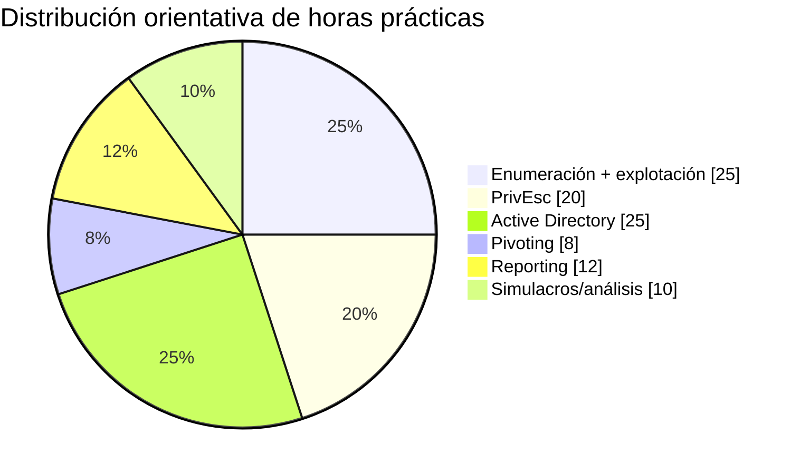

# Plan de estudio OSCP+ — 12 y 24 semanas

> Basado en la organización pública de PEN-200 de OffSec, adaptado a una persona que ya posee fundamentos de pentesting y está trabajando Active Directory. Es una propuesta de estudio, no un calendario oficial.

# Ruta A — 12 semanas intensiva

## Semana 1 — Baseline + metodología
- diagnóstico del scorecard;
- Nmap TCP/UDP;
- HTTP/SMB/SMTP/SNMP;
- sistema de notas;
- 2–3 labs de enumeración.

**Objetivo:** que el recon sea mecánico y reproducible.

## Semana 2 — Web I
- traversal/LFI/RFI;
- file upload;
- command injection;
- Burp/curl;
- content discovery;
- 3–5 labs.

## Semana 3 — Web II + exploits públicos
- APIs;
- SQLi fundamental;
- searchsploit;
- leer/adaptar PoCs;
- debugging de Python/bash/C básico;
- 3–5 labs.

## Semana 4 — Linux PrivEsc
- sudo;
- SUID/capabilities;
- cron/systemd;
- credenciales;
- permisos;
- servicios locales;
- 4–6 labs/escenarios.

## Semana 5 — Windows PrivEsc
- token privileges;
- services/ACLs;
- scheduled tasks;
- credenciales;
- registry/config;
- 4–6 labs/escenarios.

## Semana 6 — AD fundamentos prácticos
- LDAP/SMB;
- usuarios/grupos;
- Kerberos;
- PowerView/Impacket;
- BloodHound;
- 2 mini-dominios/labs.

## Semana 7 — AD encadenado
- credenciales;
- sesiones;
- ACLs;
- movimiento lateral;
- WinRM;
- ataque encadenado de varias máquinas.

## Semana 8 — Pivoting + redes internas
- rutas;
- SSH tunneling;
- SOCKS/proxychains;
- chisel;
- lab de pivoting;
- lab AD con segmento interno.

## Semana 9 — Reporting
- mini-informes completos;
- screenshots;
- reproducibilidad;
- reconstruir 2 máquinas sólo desde notas;
- practicar informe técnico.

## Semana 10 — Challenge labs
- máquinas sin hints;
- límite de tiempo por hipótesis;
- métricas de rabbit holes;
- 1 simulacro de 6–8 h.

## Semana 11 — Simulacro grande
- entorno tipo examen;
- puntos equivalentes;
- descansos;
- documentación simultánea;
- informe final.

## Semana 12 — Gap closing
- analizar los últimos 3 labs/simulacros;
- reforzar sólo gaps;
- segundo simulacro;
- lectura completa de reglas oficiales;
- checklist de entorno.

---

# Ruta B — 24 semanas sostenible

## Fase 1 — Fundamentos profesionales (1–4)
- semana 1: metodología/notas;
- semana 2: redes y Nmap;
- semana 3: servicios;
- semana 4: web discovery.

## Fase 2 — Explotación (5–8)
- semana 5: traversal/LFI/RFI;
- semana 6: uploads/command injection;
- semana 7: SQL/API/auth;
- semana 8: PoCs y shells.

## Fase 3 — PrivEsc (9–12)
- semanas 9–10: Linux;
- semanas 11–12: Windows.

## Fase 4 — AD (13–17)
- semana 13: arquitectura/LDAP/SMB;
- semana 14: Kerberos;
- semana 15: BloodHound/PowerView;
- semana 16: credenciales/movimiento;
- semana 17: dominio completo.

## Fase 5 — Pivoting + reporting (18–19)
- semana 18: túneles y redes internas;
- semana 19: notas/reporting.

## Fase 6 — Exam conditioning (20–24)
- semana 20: challenge labs;
- semana 21: challenge labs;
- semana 22: simulacro 1;
- semana 23: remediación de gaps;
- semana 24: simulacro 2 + decisión.

# Volumen semanal sugerido

## Intensivo
15–20 h/semana.

## Sostenible
8–12 h/semana.

## Distribución de tiempo orientativa

No es la ponderación oficial; es una recomendación de práctica para alguien con fundamentos previos:

# Rutina de una sesión de 2 horas

- 10 min — revisar objetivos.
- 80 min — lab sin hints.
- 15 min — notas limpias.
- 10 min — lección aprendida/cheatsheet.
- 5 min — actualizar readiness.

# Regla de hints

Primer intento:
- 0–45 min: sin hints;
- después: sólo si se ha agotado el checklist y se ha registrado qué se probó;
- tras usar un hint, continuar sin walkthrough si es posible;
- repetir la máquina días después desde cero.

# Fuentes oficiales de planificación

- 12-week OffSec plan: https://help.offsec.com/hc/en-us/articles/15541765522196-OffSec-PEN-200-Learning-Plan-12-Week
- 24-week OffSec plan: https://help.offsec.com/hc/en-us/articles/15545672357780-OffSec-PEN-200-Learning-Plan-24-Week
