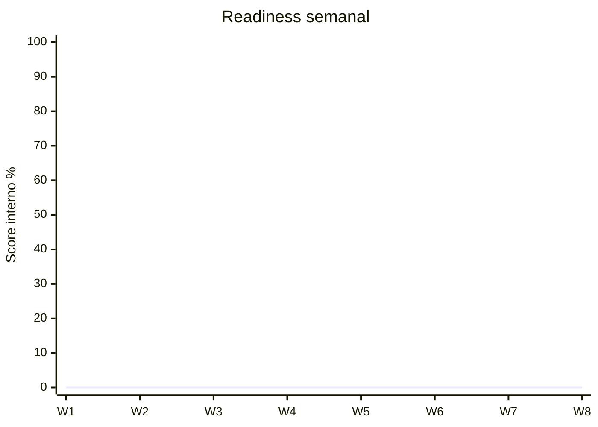

# Lab Tracker — plantilla

## Tabla maestra

| # | Fecha | Plataforma | Máquina/Lab | SO | Vector inicial | PrivEsc | AD | Pivot | Tiempo | Hints | Estado | Reporte |
|---:|---|---|---|---|---|---|---|---|---:|---:|---|---|
| 1 |  |  |  |  |  |  |  |  |  |  |  |  |

## Estados

- 🔴 `BLOCKED` — no resuelto.
- 🟠 `HINTED` — resuelto con pistas.
- 🟡 `SOLVED` — resuelto sin walkthrough.
- 🟢 `REPEATABLE` — repetido días después sin ayuda.
- 🔵 `EXAM_READY` — resuelto cronometrado + informe reproducible.

## Ficha de una máquina

```markdown
# <MACHINE>

## Metadata
- Date:
- Platform:
- OS:
- Difficulty:
- Start:
- End:

## Recon time
- Ports discovered:
- Service mapping finished:

## Initial access
- Correct vector:
- Time to foothold:
- Wrong hypotheses:

## PrivEsc
- Correct vector:
- Time to admin/root:

## AD/Pivoting
- Domain:
- Controlled principal:
- Movement path:
- Tunnel/topology:

## Help
- Hints used:
- Walkthrough used:
- Exact moment help became necessary:

## Documentation
- Screenshots complete: yes/no
- Commands complete: yes/no
- Reproduced from notes: yes/no

## Lessons
1.
2.
3.

## New cheatsheet entries
-
```

## Métricas mensuales

Calcula:

```text
Autonomous solve rate = solved_without_hints / total × 100
Repeatability rate = repeated_successfully / solved × 100
Report completeness = reproducible_reports / total × 100
Median foothold time
Median PrivEsc time
Average rabbit holes per machine
```

## Objetivos sugeridos antes de examen

No son oficiales:

- ≥70% de labs recientes sin hints;
- ≥80% de informes reproducibles;
- mediana de rabbit holes largos en descenso;
- al menos 3 cadenas AD practicadas;
- al menos 2 simulacros equivalentes ≥70;
- capacidad de repetir técnicas después de una semana.

## Gráfico manual de evolución

Actualiza con tus scores semanales:


