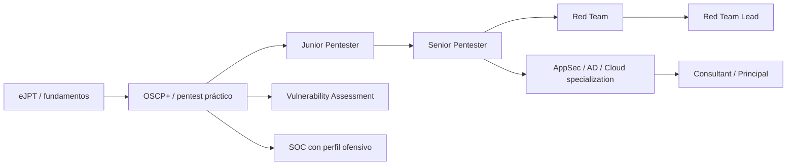

# Salidas profesionales, uso legítimo y límites legales

## 1. Qué demuestra OSCP+

OffSec describe OSCP como una certificación práctica relevante para funciones como penetration tester, security analyst y consultant. El valor profesional no es únicamente el título: demuestra una base práctica de enumeración, explotación, escalada de privilegios y reporting.

Fuente oficial: https://help.offsec.com/hc/en-us/articles/360040165632-OSCP-Exam-Guide

## 2. Salidas profesionales legítimas

### Penetration Tester
Evaluaciones autorizadas de redes, hosts, web y Active Directory.

### Junior / Mid Red Team
Simulación de adversarios dentro de un Rules of Engagement acordado.

### Security Consultant
Pentesting, revisiones técnicas, asesoría de mitigaciones y comunicación con clientes.

### Vulnerability Assessment / Vulnerability Management
Validación de vulnerabilidades, priorización y remediación.

### Application Security
Especialmente si complementas OSCP con web, código y SDLC seguro.

### Active Directory Security / Identity Security
Auditorías de AD, hardening, rutas de privilegios y configuración de identidad.

### Purple Team
Conectar TTPs ofensivas autorizadas con telemetría y detecciones defensivas.

### SOC / Detection Engineering con perfil ofensivo
Comprender cómo se produce una cadena de ataque mejora investigación y detección.

### Security Research / Bug Bounty autorizado
Investigar programas que otorguen permiso explícito y respetar exactamente su scope.

### Freelance Pentesting
Sólo con contrato, scope, autorización y condiciones claras sobre datos, horarios, técnicas y reporting.

## 3. El certificado no garantiza empleo

Experiencias públicas recientes muestran resultados distintos: algunas personas consiguen roles de pentesting después de OSCP y otras necesitan meses de búsqueda, networking o experiencia complementaria. Por tanto:

**OSCP + portfolio + comunicación + experiencia demostrable > OSCP aislado.**

## 4. Portfolio recomendado

Sin publicar secretos de labs/exámenes protegidos:

- write-ups de CTFs donde esté permitido;
- metodología propia;
- herramientas pequeñas;
- scripts de automatización de notas/recon;
- informes de laboratorio sanitizados;
- diagramas de AD;
- GitHub limpio y navegable;
- artículos explicando conceptos, no flags de examen.

## 5. Camino de carrera sugerido

## 6. Especializaciones posteriores

Dependiendo de interés:

- OSEP / evasión y red team avanzado;
- OSWE / web exploitation avanzado;
- OSED / exploit development;
- cloud security;
- Active Directory / identity;
- mobile;
- APIs;
- OT/ICS;
- AI security/red teaming.

## 7. Sobre “usos ilegítimos”

Las mismas bases técnicas pueden aparecer en ataques reales, pero **no existe una salida profesional legítima basada en comprometer sistemas sin permiso**. Acceder, mantener persistencia, extraer datos, desplegar malware, extorsionar o comercializar accesos sin autorización puede implicar responsabilidad penal y civil.

Este repositorio no incluye instrucciones operativas para delitos, evasión de autoridades, venta de accesos, robo de credenciales o intrusiones contra objetivos reales.

### Qué sí merece estudiarse

- cómo redactar un scope;
- Rules of Engagement;
- autorización escrita;
- minimización de impacto;
- tratamiento de datos;
- evidencia y cadena de custodia cuando proceda;
- responsible disclosure;
- bug bounty dentro de scope;
- cómo detener una prueba cuando aparece riesgo inesperado.

## 8. Regla de autorización

Antes de una prueba real deben estar claros como mínimo:

- propietario/cliente;
- activos incluidos y excluidos;
- fechas/horarios;
- técnicas permitidas/prohibidas;
- tratamiento de credenciales y datos;
- contactos de emergencia;
- condiciones de parada;
- entrega y destrucción de evidencias.

## 9. Mercado y expectativas

Fuentes comunitarias de 2026 muestran que OSCP sigue siendo reconocible en procesos de pentesting, pero el mercado junior puede ser competitivo. El networking, experiencia IT previa, portfolio y habilidades de comunicación aparecen repetidamente como factores importantes.

Referencias públicas:
- https://www.reddit.com/r/oscp/comments/1vm5jy0/how_did_you_get_a_job_after_the_oscp/
- https://www.reddit.com/r/oscp/comments/1rmzek6/cyber_security_job/
- https://www.reddit.com/r/oscp/comments/1vjbjfv/life_after_oscp_was_it_worth_it/

## 10. OSCP vs OSCP+

La información de OffSec en 2026 indica que OSCP+ requiere mantenimiento y expira tras tres años si no se mantiene/recertifica, mientras que el OSCP subyacente puede conservarse de por vida. OffSec mantiene un programa CPE y opciones de mantenimiento; revisa condiciones y costes vigentes cuando apruebes.

Fuentes:
- https://help.offsec.com/hc/en-us/articles/35366391096596-OffSec-CPE-Program-and-Annual-Maintenance-Handbook
- https://help.offsec.com/hc/en-us/articles/29840452210580-Changes-to-the-OSCP
