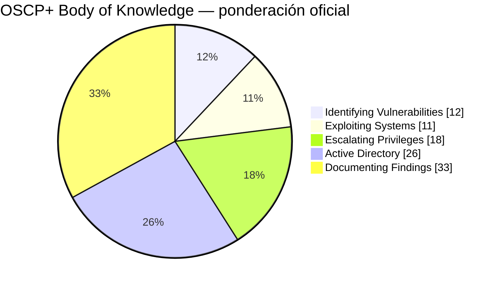

# OSCP / OSCP+ — Professional Study Repository

> Objetivo: convertir este repositorio en un manual profesional, una ruta de práctica y un sistema de seguimiento para preparar PEN-200 y el examen OSCP+ de forma legal y reproducible.

Contenido contrastado con documentación pública de OffSec revisada en septiembre de 2026.

## Estructura

- `00_START/` — mapa general, diagnóstico y orden recomendado.
- `01_METHODOLOGY/` — metodología de pentesting y enumeración.
- `02_EXPLOITATION/` — explotación de servicios y aplicaciones web.
- `03_PRIVESC/` — escalada de privilegios Linux y Windows.
- `04_ACTIVE_DIRECTORY/` — enumeración y ataque de AD en laboratorios autorizados.
- `05_PIVOTING/` — tunneling, port forwarding y redes internas.
- `06_REPORTING/` — notas, evidencias e informe profesional.
- `07_EXAM/` — formato, reglas, estrategia y experiencias públicas.
- `08_PROGRESS/` — porcentajes, métricas, simulacros y readiness.
- `09_CAREER/` — salidas profesionales, portfolio y ética/legalidad.
- `10_RESOURCES/` — fuentes oficiales y recursos comunitarios.

## Ponderación oficial del Body of Knowledge

| Dominio | Peso |
|---|---:|
| Identifying Vulnerabilities | 12% |
| Exploiting Systems | 11% |
| Escalating Privileges | 18% |
| Active Directory | 26% |
| Documenting Findings | 33% |

## Estructura del examen actual

- 3 máquinas standalone: 60 puntos totales, 20 por máquina.
  - 10 puntos por acceso inicial.
  - 10 puntos por escalada de privilegios.
- 1 conjunto Active Directory de 3 máquinas: 40 puntos.
  - Máquina 1: 10.
  - Máquina 2: 10.
  - Máquina 3: 20.
- Aprobado: **70/100**.
- Sin bonus points.
- Los chatbots/IA no están permitidos durante el examen ni durante la fase de reporting.

## Principio central

OSCP no es una competición de memorizar comandos. Hay que entrenar un ciclo repetible:

**enumerar → formular hipótesis → validar → conseguir foothold → enumerar localmente → escalar → pivotar si procede → documentar → revisar.**

## Límites éticos

Todo el material técnico debe emplearse exclusivamente en sistemas propios, laboratorios, CTFs o infraestructuras para las que exista autorización expresa. El repositorio no contiene dumps de examen, preguntas filtradas, credenciales robadas ni instrucciones orientadas a comprometer objetivos reales sin autorización.

## Fuentes oficiales principales

- https://help.offsec.com/hc/en-us/articles/360040165632-OSCP-Exam-Guide
- https://help.offsec.com/hc/en-us/articles/4412170923924-OSCP-Exam-FAQ
- https://help.offsec.com/hc/en-us/articles/38543335188756-OSCP-Body-of-knowledge
- https://help.offsec.com/hc/en-us/articles/37192004980628-Authoritative-References-List-OSCP
- https://help.offsec.com/hc/en-us/articles/40393367449108-OSCP-Candidate-Handbook
- https://help.offsec.com/hc/en-us/articles/360046787731-OSCP-Reporting-Requirements
- https://help.offsec.com/hc/en-us/articles/15541765522196-OffSec-PEN-200-Learning-Plan-12-Week
- https://help.offsec.com/hc/en-us/articles/15545672357780-OffSec-PEN-200-Learning-Plan-24-Week

## Cómo usar este repositorio

1. Leer `00_START/01_OSCP_MASTER_MAP.md`.
2. Hacer el diagnóstico de `08_PROGRESS/01_READINESS_SCORECARD.md`.
3. Seguir la ruta técnica en orden.
4. Resolver laboratorios sin walkthrough durante el primer intento.
5. Escribir notas reproducibles desde el primer día.
6. Hacer simulacros cronometrados y registrar métricas.
7. Reforzar el área con menor puntuación, no la que resulte más entretenida.
